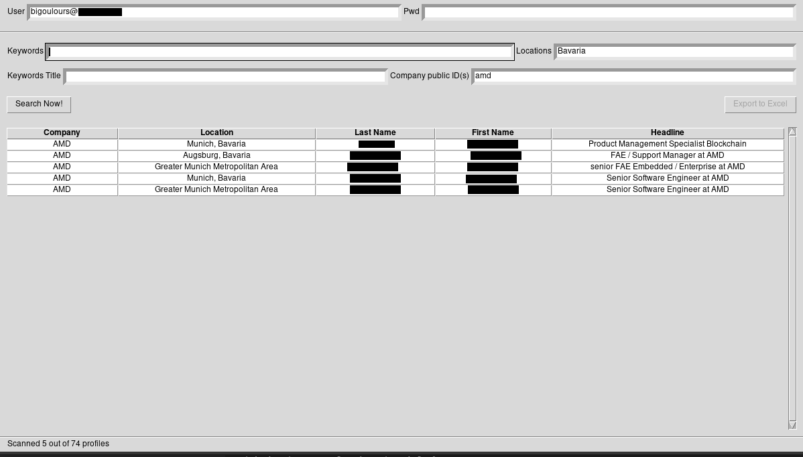

This tool allows any LinkedIn user to search people with their own credentials.\
It is based on [linkedin-api](https://github.com/bigoulours/linkedin-api) which uses the LinkedIn Voyager API.\
Install dependencies with:
```
pip install -r requirements.txt
```
Search can be done using a specific company public ID (www[]().linkedin.com/company/\<public-id\>), thus narrowing search results.\
Company public IDs and Bing geo urn IDs can be added in the dedicated text files.\
User name is saved in linkedInSearch_login. Thanks to cookies, you don't have to enter your password every time.\
/!\ Be sure to install a recent version of linkedin-api:
```pip3 install linkedin-api~=2.0.0a```

